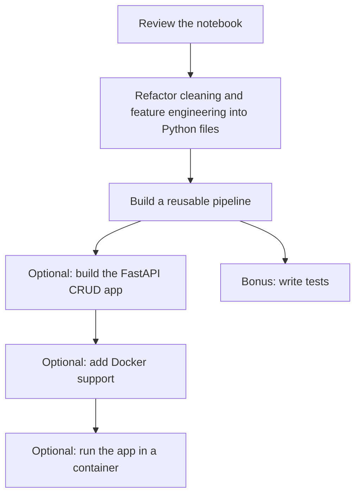

# Project for Today

You will work with the [Jupyter notebook](./King-County.ipynb), which already contains exploratory data analysis, data cleaning, feature engineering, and several machine learning models. The required libraries are listed in [requirements.txt](./requirements.txt).

Your main tasks are:

- Refactor the data-cleaning and feature-engineering code into Python files.
- Build a reusable pipeline for data cleaning and feature engineering.

If you still have time, continue with the stretch tasks:

- Build a FastAPI app that supports Create, Read, Update, and Delete operations for houses stored in a database, using 5 features.
- Create a `Dockerfile` for the app.
- Run the app inside a Docker container.

**Bonus:** Write tests.

Push your code to your GitHub repository and share the link with us on Discord. If the repository is private, invite us as collaborators.

## Answer the Following Questions in `README.md`

- What steps did you take to complete the project?
- What challenges did you face?
- What would you do differently if you had more time?
